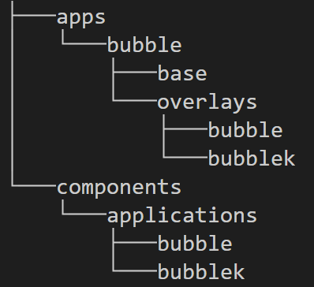

# gitops-demo
GitOps Demo using Openshift Local, ArgoCD, HelmChart

## Instructions

### Install and Set up RedHat Openshift Local
Install RedHat Openshift Local(mac/windows/linux)
> It can be installed over **Redhat Openshift Local**

Setup RedHat Openshift Local on Terminal
```bash
 crc setup -b C:\Users\<your username>\.crc\cache\crc_hyperv_<version_number>_amd64.crcbundle
 crc start -b C:\Users\<your username>\.crc\cache\crc_hyperv_<version_number>_amd64.crcbundle -c 6 -d 32 -m 13222
 oc login -u kubeadmin -p <password>
 ```
> After setting up Openshift, just follow the instructions that appeared on terminal.

### Install Gitops Operator

> Open Openshift Console
> Go to Operator Hub
> Look for gitops Operator
> Install with default configurations

### Cluster-Admin Role to Argocd-application-Controller
```bash
oc login -u kubeadmin
oc adm policy add-cluster-role-to-user cluster-admin -z openshift-gitops-argocd-application-controller -n openshift-gitops
```
### Argocd

> * Open Openshift Console
> * Click on Square Button on top right besides alarm logo or use oc command to get argocd url
```bash
oc get routes -n openshift-gitops | grep openshift-gitops-server | awk '{print $2}'
```
> * Open Cluster Argo CD. It opens in a new window
> * go back to openshift console
> * look for secret called openshift-gitops-cluster and copy the admin password or just use oc commands to get admin passwort:
```bash
oc extract secret/openshift-gitops-cluster -n openshift-gitops --to=-
```
> * go back to argocd
> * login to argocd with username 'admin' and password
> * there you are

### simple-app
we deploy an app over ocp. we use **oc apply** command
````bash
git clone https://github.com/gulec2000/gitops-demo-cl.git
cd gitops-demo-cl
oc apply -f simple-app/application.yaml
````

### bubble-app

````bash
git clone https://github.com/gulec2000/gitops-demo-cl.git
cd gitops-demo-cl
oc apply -f bubble-app/argo-application.yaml
````
* **Changing bubble color to green**

> * As we use gitops method, at first, we change deployment.yaml in bubble-app directory in github
> * Then we change env value to green
> * commit and push the change to git remote repo
> * check the website, whether change of bubble color can be observed

### Kustomize Usage with Argocd and Openshift

>* Creating a bubble app with different color using Kustomize
>* Overview of Kustomize tree



* Bubble App
````bash
cd kustomize/
oc apply -f components/applications/bubble/bubble-app.yaml
````
> * go to routes in bubble-app namespace and open the browser. It should be green
* Bubblek App
````bash
cd kustomize/
oc apply -f components/applications/bubblek/bubblek-app.yaml
````
> * go to routes in bubblek namespace and open the browser. It should be yellow
### Helm Chart with argocd and Openshift
* Quarkus app using helm chart as source

````bash
cd quarkus-helm/
oc apply -f quarkus.yaml
````
* Quarkus app with helm chart using git as source

````bash
cd quarkus-helm/
oc apply -f quarkus-subchart.yaml
````
### App of apps
* Pricelist-Web App with app of apps usage of argocd over openshift
>* This app consists of three sub-apps in argocd. We apply only pricelist-app. But there will be 4 apps in argocd 
````bash
cd app of apps/
oc apply -f pricelist-app.yaml
````


 
 

 
 
